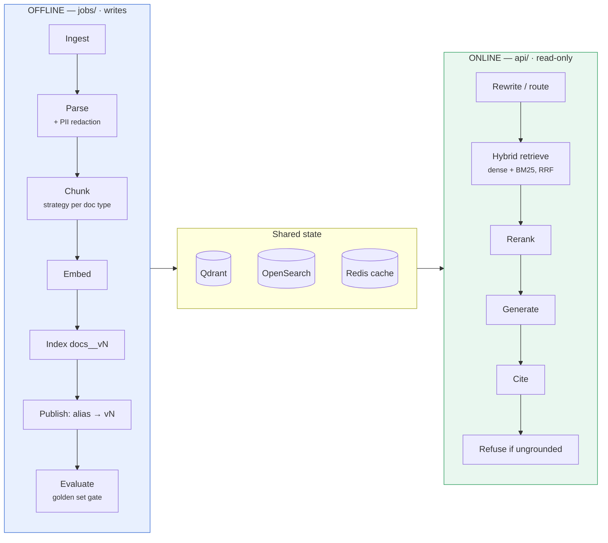

# Production RAG

A production RAG system is not a notebook with a vector database attached. It is
**two systems joined by a clear contract**:

```
Offline   Ingest → Parse → Chunk → Embed → Index → Evaluate
Online    Query Rewrite → Hybrid Retrieve → Rerank → Generate → Cite → Refuse
```

They stay separate. If ingestion and indexing live inside the API path, an indexer
eventually ships into production requests — and that is where the latency, the
cost, and the incidents begin. Here the separation is enforced by a test that
walks the **transitive** import graph, so the API process provably loads zero
ingestion, parsing, or chunking code.

Everything runs out of the box with **no external services**: deterministic
in-memory vector store, BM25, embedder, and LLM stubs. Swap in Qdrant, OpenSearch,
Redis, and OpenAI with environment variables.

[](../../actions/workflows/ci.yml)

---

## Quickstart

Requires Python 3.11+ and [uv](https://docs.astral.sh/uv/).

```bash
git clone <this repo> && cd ai-rag
just sync                # install dependencies
just env                 # create .env from the template
just check               # lint + typecheck + 60 tests, ~2s
just demo                # index the sample corpus and evaluate it
```

Serve the API and ask a question:

```bash
just serve               # http://localhost:8000/docs
```

```bash
curl -X POST localhost:8000/query \
  -H 'Content-Type: application/json' \
  -H 'X-Tenant: default' -H 'X-Groups: public' \
  -d '{"query": "What is hybrid retrieval?"}'
```

> The in-memory backends live inside a single process, so an index built by the
> CLI is not visible to a separately started API. For a shared index, use the
> Docker stack below or point at Qdrant/OpenSearch.

---

## Architecture at a glance



Full diagrams — module map, request sequence, ACL layers, index lifecycle,
deployment topology — in **[docs/architecture.md](docs/architecture.md)**.

## The rules, and where they live in the code

| Rule | Implementation |
|---|---|
| **Never mix raw data with application code** | `data/**` gitignored except its layout; `configs/` and `.env` outside `src/`; containers mount `./data` read-only |
| **Hybrid search + reranking before generation** | `retrieval/hybrid.py` → `rerank/` → `generation/` in that fixed order; the model never chooses what to retrieve |
| **Evaluation and tracing are part of the product** | `eval/` with a CI gate (`--min-recall`); a span on every stage; a trace id on every answer |
| **Index versions, caching, ACLs make it scalable** | `index_registry.py` + alias promotion; ACL-scoped exact and semantic caches |
| **Never embed or retrieve an unauthorized document** | ACLs stamped at ingest, pushed into both backends, rechecked after fusion, folded into cache keys |

## Project layout

```
data/                raw · interim · processed · golden   (gitignored content)
configs/             base · retrieval · chunking · index_versions · auth.example
docs/                architecture, runbooks, ADRs
src/rag/
  schemas/           contracts: Document · Chunk · QueryResult · Answer · Principal
  ingestion/         source connectors, checksums, mime detection
  parsing/           text · markdown · html · pdf
  chunking/          fixed · recursive · markdown_aware · semantic
  embedding/         hash (stub) · openai
  vectordb/          memory (stub) · qdrant
  lexical/           bm25_memory (stub) · opensearch
  retrieval/         hybrid retrieval, RRF, ACL pushdown
  rerank/            identity · cross_encoder
  query/             rewrite · route · multi_query · hyde
  cache/             exact · semantic · redis
  prompts/           versioned templates
  generation/        grounded answers · citations · refusal
  llm/               provider adapters + retry, timeout, fallback
  eval/              golden sets · Recall@K · MRR · nDCG · faithfulness
  observability/     traces · metrics · cost · logging
  security/          authentication · chunk-level ACLs · PII redaction
  pipelines/         offline.py · online.py
  api/               FastAPI — online query path only
  jobs/              CLI: ingest · reindex · activate · versions · eval
main.py              single entry point for both processes
```

---

## Running it — all modes

### 1. Local, zero dependencies (default)

Stub backends. Useful for development, tests, and understanding the flow.

```bash
just sync && just env
just serve                     # API with autoreload
just test                      # 60 tests, no services needed
just demo                      # index sample corpus + evaluate
```

### 2. Local with real backends

Start the data services, then point the app at them:

```bash
docker compose up -d qdrant opensearch redis
uv sync --extra dev --extra all

export RAG_VECTOR_BACKEND=qdrant RAG_LEXICAL_BACKEND=opensearch RAG_CACHE_BACKEND=redis
export RAG_EMBEDDING_BACKEND=openai RAG_LLM_BACKEND=openai OPENAI_API_KEY=sk-...

rag ingest --source data/raw --tenant acme --groups engineering
just serve
```

Now the index is shared: the CLI writes it and the API reads it.

### 3. Full Docker stack

API, Qdrant, OpenSearch, and Redis, with the indexing job as a separate container.

```bash
just up                        # docker compose up -d --wait
just docker-reindex v1         # offline job — never inside the API
curl localhost:8000/ready
just logs api
just down                      # just clean also removes volumes
```

Real models instead of stubs:

```bash
OPENAI_API_KEY=sk-... RAG_EMBEDDING_BACKEND=openai RAG_LLM_BACKEND=openai just up
```

### 4. Offline jobs (CLI)

```bash
rag ingest   --source data/raw --tenant acme --groups engineering
rag reindex  --source data/raw --index-version v2 --no-activate   # build, don't publish
rag eval     --dataset data/golden/golden.jsonl --min-recall 0.8  # verify first
rag activate --index-version v2                                   # publish (or roll back)
rag versions                                                      # history + active version
```

`main.py` is equivalent (`python main.py reindex --index-version v2`) and is what
the containers run.

### 5. Production

```bash
RAG_ENV=production                       # rejects unsafe config at startup
RAG_VECTOR_BACKEND=qdrant
RAG_LEXICAL_BACKEND=opensearch
RAG_CACHE_BACKEND=redis                  # required with >1 replica
RAG_EMBEDDING_BACKEND=openai
RAG_LLM_BACKEND=openai
RAG_LLM_FALLBACK_MODELS=gpt-4o
RAG_AUTH_TOKENS_FILE=/run/secrets/auth.yaml
RAG_AUTH_TRUST_HEADERS=false

uvicorn rag.api.app:app --host 0.0.0.0 --port 8000 --workers 4
```

With `RAG_ENV=production` the process **refuses to start** if header-trust auth is
on or a stub embedder/LLM is selected. Liveness is `/health`; readiness is
`/ready`. Checklist and sizing: [docs/deployment.md](docs/deployment.md).

---

## API

| Method | Path | Purpose |
|---|---|---|
| `POST` | `/query` | answer a question over the indexed corpus |
| `GET` | `/health` | liveness — process is alive |
| `GET` | `/ready` | readiness — alias resolves and the index is populated |
| `GET` | `/metrics` | counters and histograms |

```json
{
  "answer": {
    "text": "Hybrid retrieval combines dense and lexical search [a1b2c3d4].",
    "citations": [{"chunk_id": "a1b2c3d4", "doc_id": "hybrid_retrieval", "quote": "…", "score": 0.032}],
    "refused": false,
    "usage": {"total_tokens": 500, "cost_usd": 0.00012, "model": "gpt-4o-mini", "prompt_version": "v1"},
    "trace_id": "…", "index_version": "v1", "latency_ms": 842.3, "cached": false
  }
}
```

**A refusal is HTTP 200 with `refused: true` and no citations.** The request
succeeded; the corpus (as visible to this caller) does not support an answer.
Branch on `refused`, never on the status code — and note that a caller without
access gets exactly this, never a 403, because disclosing existence is itself a
leak. Details: [docs/api.md](docs/api.md).

## Security posture

Fail closed. With no authenticator configured, every request gets 401.

- `Principal` (subject, tenant, groups) comes from a **verified bearer token**.
  `X-Tenant`/`X-Groups` headers are honoured only by the dev authenticator, which
  `Settings` refuses to enable outside dev.
- ACLs live on the **chunk**, are pushed into Qdrant and OpenSearch, and are
  rechecked after fusion.
- The ACL fingerprint is part of every cache key and semantic-cache bucket, so
  cross-tenant hits are structurally impossible — proven with the similarity
  threshold forced to `0.0`.
- PII is redacted **before embedding**, not only on output.
- Secrets stay in `.env` / your secret manager; `configs/auth.yaml` is gitignored.

Threat model, limitations, and incident response: [docs/security.md](docs/security.md).

## Quality gates

```bash
just check          # ruff + mypy --strict + pytest
just eval-gate 0.8  # fail if Recall@5 regresses
```

CI runs lint, types, and tests on Python 3.11 and 3.13; a golden-set evaluation
gate; and a Docker build that asserts `/health` comes up and `/ready` correctly
returns 503 with no index. Evaluation is a build gate, the same as a unit test.

## Documentation

| | |
|---|---|
| [Architecture](docs/architecture.md) | diagrams and the reasoning behind the split |
| [Agentic RAG](docs/agentic.md) | bounded agent as a third subsystem |
| [Contracts](docs/contracts.md) | what `Document`, `Chunk`, `Answer` guarantee |
| [Offline pipeline](docs/offline-pipeline.md) | ingest → parse → chunk → embed → index |
| [Online pipeline](docs/online-pipeline.md) | rewrite → retrieve → rerank → generate → refuse |
| [Retrieval](docs/retrieval.md) | RRF, BM25, ACL pushdown, tuning |
| [Caching](docs/caching.md) | exact and semantic caches, tenant isolation |
| [Security](docs/security.md) | auth, ACLs, PII, threat model |
| [Evaluation](docs/evaluation.md) | golden sets, metrics, release gates |
| [Observability](docs/observability.md) | traces, metrics, cost, debugging |
| [Configuration](docs/configuration.md) | every setting and env var |
| [API](docs/api.md) | HTTP contract |
| [Deployment](docs/deployment.md) | Docker, Kubernetes, scaling, sizing |
| [Operations](docs/operations.md) | reindex, rollback, incident runbooks |
| [Development](docs/development.md) | add a backend, chunker, or connector |
| [ADRs](docs/adr/) | why the expensive decisions were made |

## Task reference

```bash
just                 # list every recipe
just sync            # install deps          just sync-all     # + real backend clients
just check           # lint + types + tests  just fmt          # format and autofix
just serve           # API with reload       just serve-prod   # multi-worker
just ingest          # index data/raw        just versions     # list index versions
just build-index     # build without publishing
just activate v2     # publish or roll back
just eval            # golden-set evaluation just eval-gate    # + regression gate
just up / down       # docker stack          just docker-reindex
just docker-validate # compose + image build
```

## What is intentionally not included

Honest boundaries, so nothing looks more finished than it is:

- **No rate limiting** — belongs at the gateway.
- **No OIDC/JWT authenticator** — `Authenticator` is the seam;
  `StaticTokenAuthenticator` is a working default.
- **Faithfulness and answer relevance are lexical-overlap heuristics**, not
  LLM-as-judge. Good for regression detection, not for absolute quality.
- **No incremental reindex** — `Document.checksum` is the hook; the job rebuilds
  a whole version.
- **Metrics are per-process JSON**, not Prometheus text; `MetricsRegistry` is the
  exporter seam.
- **The Docker artifacts are unvalidated locally** — Docker is not installed on
  the development machine used here. The `container` CI job builds the image and
  smoke-tests it; treat that as the source of truth until you run it yourself.

## License

MIT
