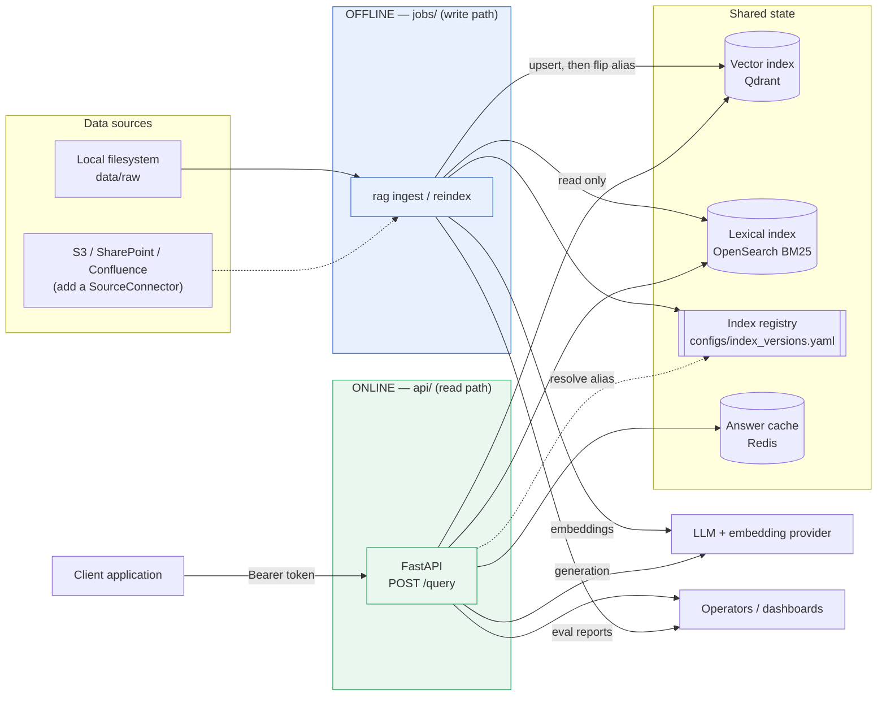
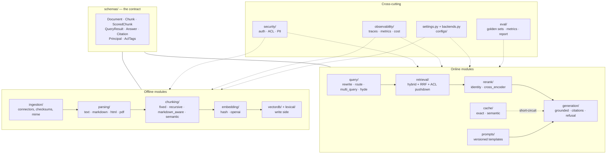
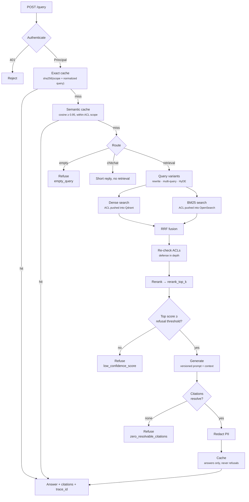
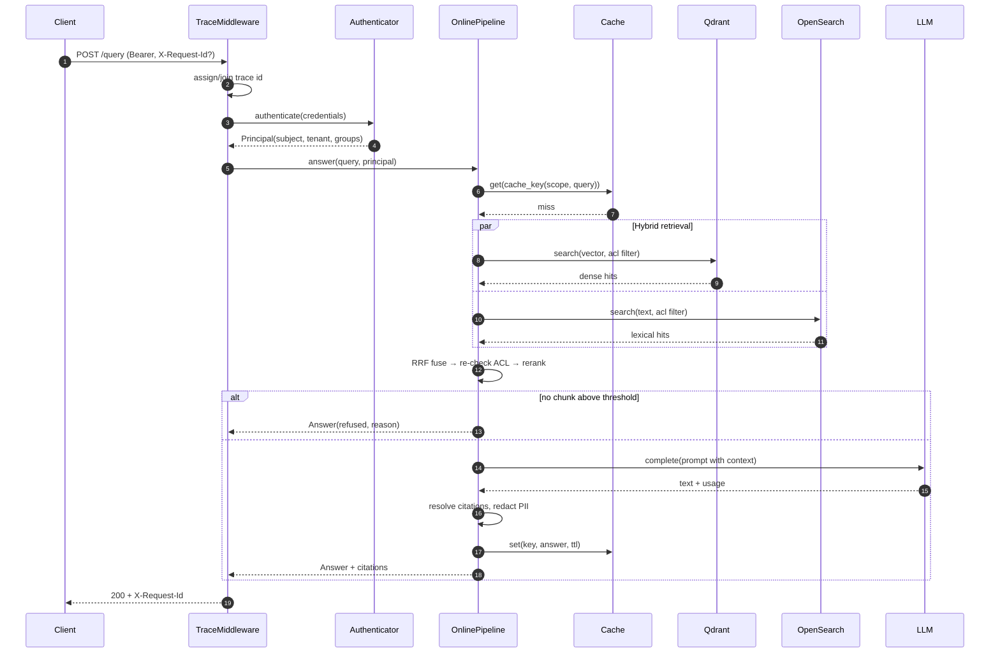
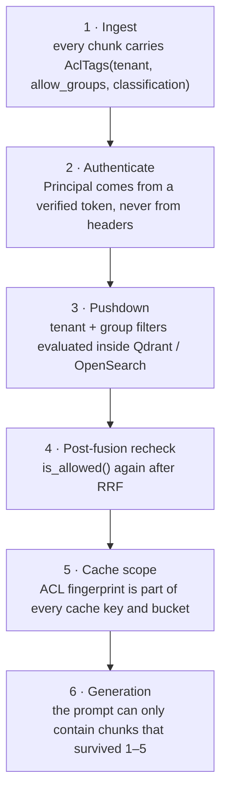
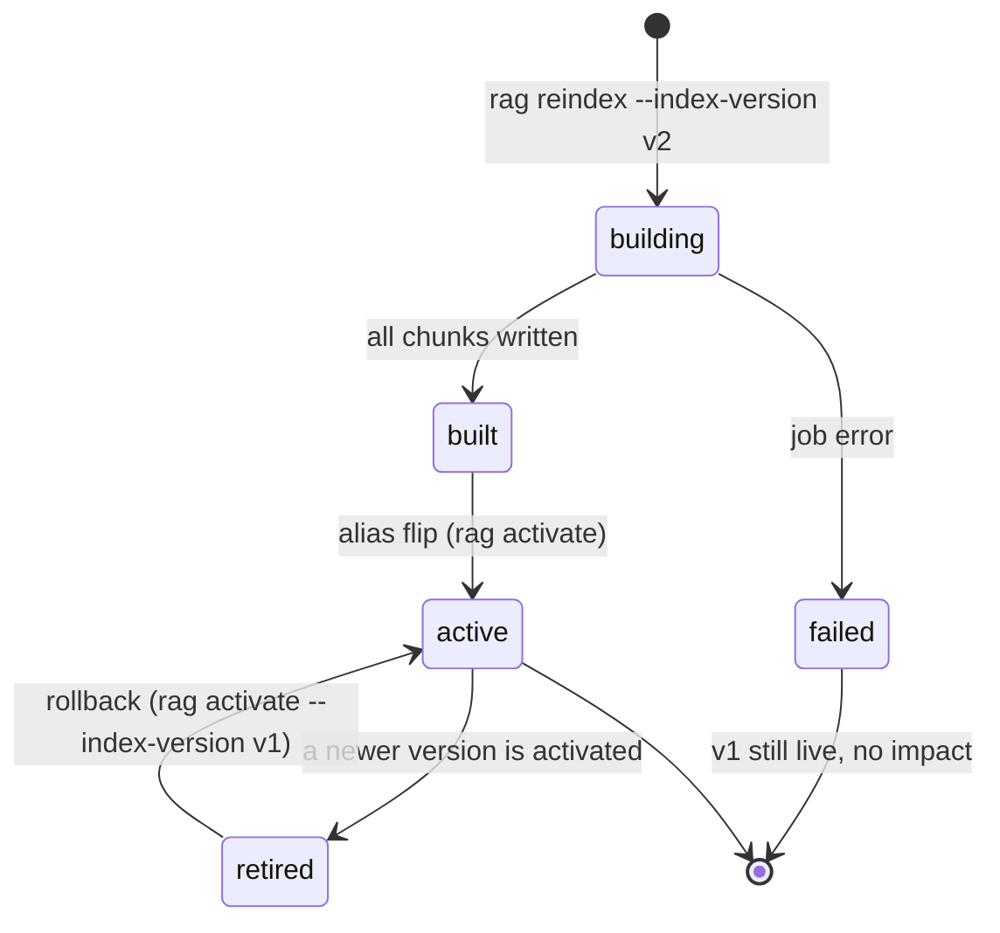
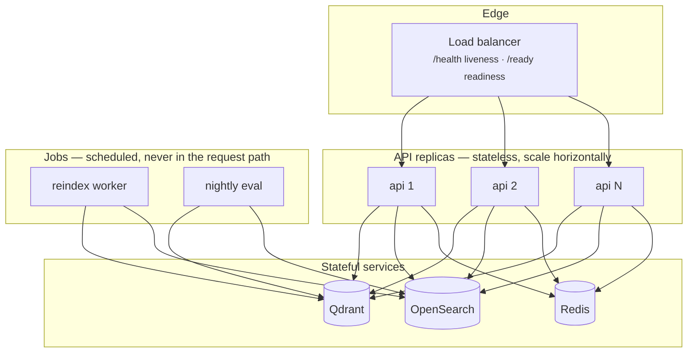

# Architecture

A production RAG system is **two systems joined by a contract**, not one
application with a vector database attached.

| | Offline pipeline | Online pipeline |
|---|---|---|
| Runs as | `jobs/` (CLI, cron, worker container) | `api/` (FastAPI process) |
| Trigger | schedule or explicit operator action | user request |
| Latency budget | minutes to hours | milliseconds |
| Writes to the index | yes | **never** |
| Failure blast radius | one index version | one request |

The contract between them is `src/rag/schemas/`: `Document`, `Chunk`,
`QueryResult`, `Answer`, `Principal`, `AclTags`. Either side can be rewritten
without touching the other as long as the contract holds.

`tests/test_architecture_boundaries.py` builds the **transitive** import graph of
the `rag` package and fails the build if anything under `rag.api` can reach
`rag.ingestion`, `rag.parsing`, `rag.chunking`, `rag.eval`, or `rag.jobs` by any
path. Importing `rag.api.app` loads zero offline modules.

Transitivity is the part that matters. A direct-import check passes while
`pipelines/__init__.py` quietly re-exports both pipelines and pulls every parser
and chunker into the API process — which is exactly the bug the strengthened test
found. The separation is enforced, not merely intended; otherwise an indexer
eventually ships inside a request handler, and with it the latency, cost, and
incidents.

---

## 1. System context

The only coupling between the two processes is shared state. Neither imports
the other.

---

## 2. Module map

Directory layout mirrors the pipeline stages, so a stack trace tells you which
stage failed.

Every box is a `typing.Protocol` with at least one dependency-free
implementation, so the whole system runs and is testable without a single
external service.

---

## 3. Offline pipeline

```mermaid
flowchart LR
    A["Ingest<br/><small>connector, checksum, mime, ACL stamp</small>"]
    B["Parse<br/><small>per mime type, PII redaction</small>"]
    C["Chunk<br/><small>strategy per document type</small>"]
    D["Embed<br/><small>model name stamped on chunk</small>"]
    E["Index<br/><small>write to docs__vN</small>"]
    F["Publish<br/><small>flip alias docs_live → vN</small>"]
    G["Evaluate<br/><small>golden set gate</small>"]

    A --> B --> C --> D --> E --> F --> G
    G -->|"regression"| H["Roll back:<br/>rag activate --index-version vN-1"]
```

Properties that make this safe to run repeatedly:

- **Deterministic chunk ids.** `short_id(doc_id, ordinal, chunker_version,
  index_version)` — re-running produces identical ids, so indexing is
  idempotent rather than duplicating content.
- **Build-then-swap.** Writes go to `docs__vN` while `docs_live` still points at
  `vN-1`. Readers never observe a half-built index, and rollback is another
  alias flip.
- **Embedding model stamped per chunk.** Changing the embedder changes
  `Chunk.embedding_model`, which makes a silent mixed-model index detectable.
- **One bad document cannot fail a reindex.** Parse failures are counted and
  skipped.

Details: [offline-pipeline.md](offline-pipeline.md).

---

## 4. Online pipeline

Retrieval and reranking always happen **before** the model is asked anything.
The model never chooses what to retrieve, and it only ever sees chunks the
caller is allowed to see.

Refusal is a normal return value — `refused=true`, empty `citations`, HTTP 200 —
not an exception. Details: [online-pipeline.md](online-pipeline.md).

---

## 5. Request sequence

Both retrieval legs run concurrently, so hybrid search costs roughly the slower
leg rather than their sum.

---

## 6. ACL enforcement layers

> Never embed or retrieve a document a user isn't allowed to access.

Layer 3 alone would be enough if backends were perfect. Layer 4 exists because
a filter regression in one adapter must not become a data leak. Layer 5 exists
because a cache is the easiest way to leak across tenants: identical text asked
by two tenants must never share an entry. `tests/test_semantic_cache.py` proves
a cross-tenant miss even with the similarity threshold forced to `0.0`.

Details and threat model: [security.md](security.md).

---

## 7. Index version lifecycle

Online readers resolve `docs_live` through the alias on every request rather
than reading a configured version name, so promotion and rollback need no
redeploy and no restart. Runbooks: [operations.md](operations.md).

---

## 8. Deployment topology

API replicas hold no durable state, which is why the cache must be Redis rather
than in-process once there is more than one replica: `MemoryCache` would give
each replica a different view of the same question. Details:
[deployment.md](deployment.md).

---

## 9. Where each rule lives in the code

| Rule | Enforced by |
|---|---|
| Never mix raw data with application code | `data/**` gitignored except layout; `configs/` separate; `.env` never committed; images mount `./data:ro` |
| Hybrid search + reranking before generation | `retrieval/hybrid.py` → `rerank/` → `generation/grounded.py`, in that fixed order in `pipelines/online.py` |
| Evaluation and tracing are part of the product | `eval/` with a CI gate (`--min-recall`); `observability/tracing.py` spans on every stage; trace id on every answer |
| Index versions, caching, ACLs make it scalable | `index_registry.py` + alias swap; `cache/` exact + semantic; `security/acl.py` |
| Never embed or retrieve an unauthorized document | ACLs stamped at ingest, pushed into both backends, rechecked after fusion, folded into cache keys |

## Further reading

- [contracts.md](contracts.md) — the schemas both pipelines depend on
- [retrieval.md](retrieval.md) — RRF, BM25, and reranking in detail
- [caching.md](caching.md) — exact and semantic cache design
- [evaluation.md](evaluation.md) — metrics and quality gates
- [observability.md](observability.md) — traces, metrics, cost
- [configuration.md](configuration.md) — every setting
- [operations.md](operations.md) — runbooks
- [adr/](adr/) — why the tricky decisions were made
