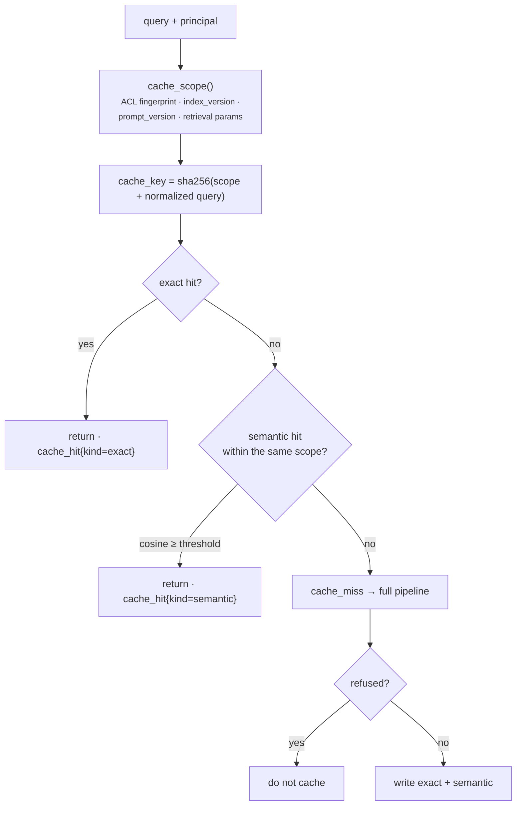

# Caching

Stop paying twice for the same question — without ever answering one tenant's
question with another tenant's data.



## The scope is the security boundary

```python
scope = sha256(acl_fingerprint(principal) + index_version + prompt_version + params)
key = sha256(f"{scope}|{normalize_query(query)}")
```

Two callers with different tenants or different group sets produce different
scopes, therefore different keys, therefore no shared entries. Cross-tenant
contamination is structurally impossible rather than prevented by a check that
someone could forget.

Folding these four things into the scope also makes invalidation automatic:

| Change | Effect |
|---|---|
| New index version published | every key changes; no stale answers from a retired corpus |
| Prompt edited (new version) | every key changes; no answers from the old instructions |
| `top_k` / `rerank_top_k` / weights changed | every key changes; A/B configurations cannot collide |
| Caller's groups change | that caller's scope changes; they stop seeing answers built from content they lost access to |

No manual flush step exists because none is needed.

## Exact cache

`normalize_query` lowercases and collapses whitespace, so *"What is RRF?"* and
*"what is   rrf?"* share an entry. Backed by `MemoryCache` (per-process, dev) or
`RedisCache` (shared, production). Entries are JSON-serialized `Answer` objects
with a TTL from `RAG_CACHE_TTL_SECONDS` (default 1 hour).

A Redis outage degrades to a miss rather than an error:

```python
try:
    value = self._client.get(self._key(key))
except Exception as exc:
    log.warning("redis get failed, treating as miss: %s", exc)
    return None
```

The cache is an optimization. It must never be able to fail a request.

## Semantic cache

Catches paraphrases the exact cache misses — *"How does hybrid search work?"* vs
*"Explain hybrid retrieval"*. Entries are bucketed by scope, and lookups only
ever compare within one bucket:

```python
self._buckets: dict[str, list[_Entry]]  # scope -> entries
```

Because the scope string is opaque and buckets are never traversed across scopes,
a cross-tenant hit cannot occur even if the similarity threshold is misconfigured.
`tests/test_semantic_cache.py` asserts a miss with `threshold=0.0`, which would
otherwise match anything.

`RAG_SEMANTIC_CACHE_THRESHOLD` defaults to `0.95`, deliberately conservative: a
false positive here does not return a slightly worse answer, it returns the
answer to a *different question*. Raise it if you see wrong hits; lower it only
with evaluation evidence.

Each bucket holds at most `max_entries_per_scope` (256) entries, evicting oldest
first, so a hot tenant cannot exhaust memory. The lookup is a linear cosine scan
over the bucket — fine at 256 entries; a real vector index is the answer if you
need more.

## What is not cached

| | Cached | Why |
|---|---|---|
| Successful answers | yes | the whole point |
| Refusals | **no** | often transient (index building, model outage); caching extends an incident for a full TTL |
| Retrieval results | no | generation dominates cost, so caching the answer subsumes it |
| Embeddings | no | worth adding if the same queries recur constantly |

## Choosing a backend

| Deployment | `RAG_CACHE_BACKEND` | Reason |
|---|---|---|
| Local dev, tests | `memory` | zero setup, deterministic |
| Single replica | `memory` | fine, though it is lost on restart |
| Multiple replicas | `redis` | otherwise each replica has a different view of the same question, and hit rate falls off with replica count |

## Operating it

The `/metrics` endpoint reports `cache_hit`, `cache_hit`,
and `cache_miss`. Hit rate is `hits / (hits + misses)`.

A sudden drop to zero almost always means the scope changed — a deploy that
published a new index version or edited a prompt. That is correct behaviour, and
it is worth knowing that a reindex costs you a cold cache.

To invalidate everything deliberately, bump the index version or the prompt
version. To flush Redis directly, `redis-cli --scan --pattern 'rag:answer:*' | xargs redis-cli del`.
