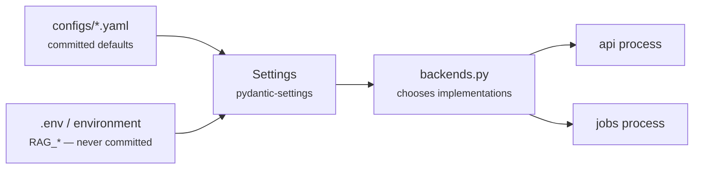

# Configuration

Config, prompts, secrets, raw data, and indexes all live outside application
code. Nothing in `src/` reads a hardcoded path, model name, or threshold.



Environment variables always win over YAML. Every field on `rag.settings.Settings`
maps to `RAG_<FIELD_NAME>` in upper case; third-party credentials keep their
conventional names (`OPENAI_API_KEY`, `QDRANT_URL`, `OPENSEARCH_URL`, `REDIS_URL`).

Start from the template:

```bash
cp .env.example .env     # or: just env
```

## Files

| File | Contains | Committed |
|---|---|---|
| `configs/base.yaml` | reference values for the default profile | yes |
| `configs/retrieval.yaml` | retrieval knobs (`RetrievalConfig`) | yes |
| `configs/chunking.yaml` | chunking strategy per mime type | yes |
| `configs/index_versions.yaml` | index version registry, written by jobs | yes |
| `configs/auth.example.yaml` | token-store shape | yes |
| `configs/auth.yaml` | real tokens | **no** |
| `.env` | secrets and per-environment overrides | **no** |

`configs/retrieval.yaml` and `configs/chunking.yaml` are read at runtime.
`configs/base.yaml` documents intent — runtime values come from `Settings`.

## Environment

| Variable | Default | Notes |
|---|---|---|
| `RAG_ENV` | `dev` | `staging`/`production`/`prod`/`stage` trigger safety validation |
| `RAG_SERVICE_NAME` | `rag-api` | reported by `/health` |

Setting `RAG_ENV=production` makes `Settings` **refuse to start** if
`auth_trust_headers` is on, `auth_required` is off, or the `hash` embedder or
`echo` LLM is selected. See [security.md](security.md#why-header-trust-is-dangerous).

## Backend selection

| Variable | Default | Options |
|---|---|---|
| `RAG_VECTOR_BACKEND` | `memory` | `memory`, `qdrant` |
| `RAG_LEXICAL_BACKEND` | `memory` | `memory`, `opensearch` |
| `RAG_EMBEDDING_BACKEND` | `hash` | `hash`, `openai` |
| `RAG_LLM_BACKEND` | `echo` | `echo`, `openai` |
| `RAG_CACHE_BACKEND` | `memory` | `memory`, `redis` |
| `RAG_RERANKER` | `identity` | `identity`, `cross_encoder` |

The defaults are deterministic stubs requiring no external services — that is what
makes the test suite hermetic and the first run zero-setup. They are not
semantically useful, and production refuses them. Each non-default option needs
its extra installed (`uv sync --extra qdrant`, etc.).

## Index identity

| Variable | Default | Notes |
|---|---|---|
| `RAG_INDEX_VERSION` | `v1` | version built by jobs; fallback when no alias resolves |
| `RAG_COLLECTION_ALIAS` | `docs_live` | what readers resolve; the cutover point |
| `RAG_COLLECTION_PREFIX` | `docs` | physical name is `{prefix}__{version}` |
| `RAG_INDEX_REGISTRY_FILE` | *(unset)* | overrides `configs/index_versions.yaml`; needed on a read-only config mount |
| `RAG_DATA_ROOT` | `data` | raw and derived data |
| `RAG_CONFIGS_ROOT` | `configs` | YAML location |

## Retrieval

| Variable | Default | Effect |
|---|---|---|
| `RAG_TOP_K` | `10` | candidates per leg before fusion |
| `RAG_RERANK_TOP_K` | `5` | candidates kept for the prompt |
| `RAG_RRF_K` | `60` | RRF smoothing; higher rewards consensus |
| `RAG_DENSE_WEIGHT` | `1.0` | trust in vector search |
| `RAG_LEXICAL_WEIGHT` | `1.0` | trust in BM25 |
| `RAG_REWRITE_ENABLED` | `true` | normalize and lightly expand the query |
| `RAG_MULTI_QUERY_ENABLED` | `false` | N paraphrases, all fused; N× retrieval cost |
| `RAG_MULTI_QUERY_COUNT` | `3` | number of variants |
| `RAG_HYDE_ENABLED` | `false` | embed a hypothetical answer for the dense leg |
| `RAG_REFUSAL_SCORE_THRESHOLD` | `0.01` | below this fused score, refuse |

`refusal_score_threshold` is compared against **RRF output**, which is small by
construction (two legs at rank 1 ≈ `0.033`). A value like `0.15` would refuse
everything. Re-derive it from an evaluation run whenever `rrf_k`, the weights, or
the number of legs changes. See [retrieval.md](retrieval.md#reciprocal-rank-fusion).

## Caching

| Variable | Default | Notes |
|---|---|---|
| `RAG_CACHE_ENABLED` | `true` | disables both layers when off |
| `RAG_CACHE_TTL_SECONDS` | `3600` | exact-cache entry lifetime |
| `RAG_SEMANTIC_CACHE_ENABLED` | `true` | paraphrase matching |
| `RAG_SEMANTIC_CACHE_THRESHOLD` | `0.95` | cosine floor; a false hit answers a *different* question |

## Models

| Variable | Default | Notes |
|---|---|---|
| `RAG_EMBEDDING_MODEL` | `text-embedding-3-small` | changing it requires a full reindex |
| `RAG_EMBEDDING_DIMENSIONS` | `1536` | must match the collection's vector size |
| `RAG_HASH_EMBEDDING_DIMENSIONS` | `64` | stub embedder only |
| `RAG_LLM_MODEL` | `gpt-4o-mini` | primary generation model |
| `RAG_LLM_FALLBACK_MODELS` | *(empty)* | comma-separated, tried in order after the primary |
| `RAG_LLM_MAX_ATTEMPTS` | `3` | attempts **per model** before falling back |
| `RAG_LLM_TIMEOUT_SECONDS` | `30` | per-attempt timeout |
| `RAG_LLM_MAX_OUTPUT_TOKENS` | `1024` | caps cost per answer |
| `RAG_LLM_TEMPERATURE` | `0.0` | grounded answers should be reproducible |

## Security

| Variable | Default | Notes |
|---|---|---|
| `RAG_AUTH_REQUIRED` | `true` | fail closed; 401 when unconfigured |
| `RAG_AUTH_TRUST_HEADERS` | `false` | **dev only**; lets callers choose their own ACL |
| `RAG_AUTH_TOKENS_FILE` | *(unset)* | bearer-token store; enables `StaticTokenAuthenticator` |
| `RAG_DEFAULT_TENANT` | `default` | tenant when none is supplied |
| `RAG_PII_REDACTION_ENABLED` | `true` | redacts before embedding and on output |

`.env.example` ships with `RAG_AUTH_TRUST_HEADERS=true` so a local run works
without an identity provider. Remove it for anything real.

## API

| Variable | Default | Notes |
|---|---|---|
| `RAG_CORS_ALLOW_ORIGINS` | *(empty)* | comma-separated; empty disables CORS entirely |
| `RAG_REQUEST_TIMEOUT_SECONDS` | `30` | client-facing budget |
| `RAG_METRICS_ENABLED` | `true` | `false` makes `/metrics` return 404 |

## Observability

| Variable | Default | Notes |
|---|---|---|
| `RAG_LOG_LEVEL` | `INFO` | |
| `RAG_LOG_JSON` | `false` | structured output |
| `RAG_LOG_DIR` | *(unset)* | also write `<dir>/app.log`; prefer stdout in containers |

## Profiles

**Local, zero dependencies** (the default): all stubs. Runs, tests, and evaluates
with nothing installed but Python.

**Local with real backends:**

```bash
RAG_VECTOR_BACKEND=qdrant
RAG_LEXICAL_BACKEND=opensearch
RAG_CACHE_BACKEND=redis
RAG_EMBEDDING_BACKEND=openai
RAG_LLM_BACKEND=openai
OPENAI_API_KEY=sk-...
```

**Production:**

```bash
RAG_ENV=production
RAG_VECTOR_BACKEND=qdrant
RAG_LEXICAL_BACKEND=opensearch
RAG_CACHE_BACKEND=redis
RAG_EMBEDDING_BACKEND=openai
RAG_LLM_BACKEND=openai
RAG_RERANKER=cross_encoder
RAG_AUTH_TRUST_HEADERS=false
RAG_AUTH_TOKENS_FILE=/run/secrets/auth.yaml
RAG_LLM_FALLBACK_MODELS=gpt-4o
RAG_INDEX_REGISTRY_FILE=/var/lib/rag/index_versions.yaml
```

## Adding a setting

1. Add the field to `Settings` with a safe default.
2. If it changes retrieval behaviour, add it to `RetrievalConfig` too — and to
   `cache_params()` if it should invalidate cached answers.
3. Document it in `.env.example` and in the table above.
4. If it can be unsafe in production, add it to `_reject_unsafe_production_config`.
