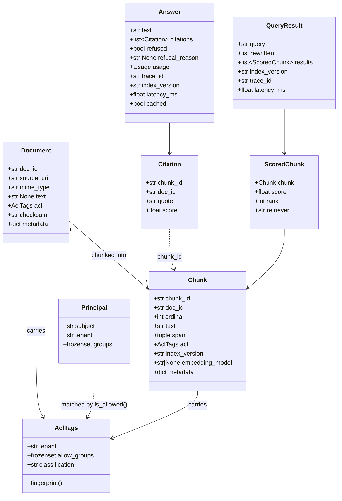

# Contracts

`src/rag/schemas/` is the interface between the offline and online systems.
Everything else is an implementation detail. These are Pydantic v2 models, so
they validate at every boundary — a malformed `Chunk` fails at construction, not
three stages later.



## Document

Produced by `ingestion/`, refined by `parsing/`. `text` is `None` until a parser
fills it, which is what makes "parsed" a distinct state rather than a
convention.

`checksum` is a SHA-256 of the raw bytes and is what lets a future incremental
reindex skip unchanged documents.

`acl` is attached **at ingest**, before any text exists. There is deliberately
no code path that produces a `Document` without ACL tags.

## Chunk

The unit of retrieval, and the unit of access control.

```python
chunk_id = short_id(doc_id, ordinal, chunker_version, index_version)
```

Deterministic and content-independent: the same document chunked the same way
into the same index version always yields the same ids, so re-running an index
job overwrites rather than duplicates. Including `chunker_version` means a
chunking change produces different ids, which is correct — they are different
chunks.

`span` is the `(start, end)` offset into the parsed document text, so a citation
can be traced back to its exact position in the source.

`embedding_model` is stamped at index time. Two chunks with different values in
the same index version mean a model changed mid-build; that index should be
rebuilt, not queried.

## ScoredChunk

Carries `retriever`, one of `dense`, `lexical`, `fused`, `rerank`. That single
field makes retrieval debuggable: you can tell whether a chunk arrived from
vector similarity, BM25, fusion, or the reranker's reordering.

`rank` is 1-based, because Reciprocal Rank Fusion divides by it.

## QueryResult

Retrieval output without generation. `retrieve_only()` returns this, and
evaluation consumes it — retrieval quality is measured without paying for a
model call.

`rewritten` holds every query variant actually issued, so a multi-query or HyDE
run is reconstructable after the fact.

## Answer

The online path's only return type, including for failures of grounding:

```python
Answer(
    text="I don't know based on the available documents.",
    citations=[],
    refused=True,
    refusal_reason="low_confidence_score",
)
```

A refusal is a successful HTTP 200. Callers branch on `refused`, never on the
status code. `refusal_reason` is one of:

| Reason | Meaning |
|---|---|
| `empty_query` | Router rejected the input before retrieval |
| `no_retrieved_context` | Nothing visible to this principal matched |
| `low_confidence_score` | Best fused score below `refusal_score_threshold` |
| `zero_resolvable_citations` | The model answered but cited nothing verifiable |
| `llm_unavailable` | Every model and retry was exhausted |

`usage` carries tokens, cost, model, and `prompt_version`, so cost is
attributable per answer and per prompt revision.

## Principal and AclTags

```python
def is_allowed(principal: Principal, acl: AclTags) -> bool:
    if principal.tenant != acl.tenant:
        return False  # tenant is a hard wall
    if not acl.allow_groups:
        return True  # tenant-wide document
    return bool(principal.groups & acl.allow_groups)
```

Tenant mismatch is never recoverable by group membership. An empty
`allow_groups` means tenant-wide, not public — there is no cross-tenant "public".

`AclTags.fingerprint()` is a stable hash used in cache keys and traces so access
scope can be logged without writing identities into logs.

## Changing a contract

Adding an optional field with a default is backwards compatible. Anything else
(renaming, removing, changing a type, changing `chunk_id` derivation) requires a
new index version and a rebuild, because persisted payloads carry the old shape.
See [operations.md](operations.md#reindex-and-promote).
