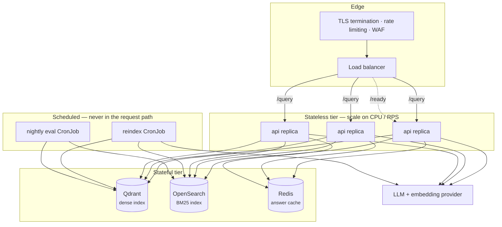

# Deployment



The API tier is stateless, so it scales horizontally without coordination. All
durable state is in Qdrant, OpenSearch, and Redis.

## Choosing backends

| | Local dev / CI | Single node | Production |
|---|---|---|---|
| Vector | `memory` | `qdrant` | `qdrant` (replicated) |
| Lexical | `memory` | `opensearch` | `opensearch` (multi-node) |
| Embeddings | `hash` | `openai` | `openai` or self-hosted |
| LLM | `echo` | `openai` | `openai` + fallback models |
| Cache | `memory` | `memory` | `redis` |
| Reranker | `identity` | `identity` | `cross_encoder` |

Two rules that are not optional:

- **`memory` cache with more than one replica is a bug.** Each replica would keep
  its own answers, so hit rate falls roughly by the replica count and two users
  can get different answers to the same question.
- **`hash` embeddings and `echo` generation are stubs.** `Settings` refuses to
  start with them when `RAG_ENV` is production or staging.

## Docker Compose

The included stack is production-*like*: real Qdrant, OpenSearch, and Redis, with
stub models so it runs without an API key.

```bash
just up                    # or: docker compose up -d --wait
just docker-reindex v1     # offline job, separate container
curl localhost:8000/ready
just logs api
just down                  # `just clean` also removes volumes
```

Points worth noting in `docker-compose.yaml`:

- `api` and `worker` are **separate services from the same image**. The API cannot
  index; the worker is behind the `jobs` profile so `up` never starts it.
- `./data` is mounted **read-only** into the worker. Raw data lives outside the
  image.
- `api` runs `read_only: true` with a tmpfs `/tmp`, `no-new-privileges`, and a
  memory limit.
- Dependencies use healthchecks with `condition: service_healthy`, so the API does
  not start against a half-initialized OpenSearch.
- To use real models: `OPENAI_API_KEY=sk-... RAG_EMBEDDING_BACKEND=openai RAG_LLM_BACKEND=openai docker compose up -d`.
- `RAG_AUTH_TRUST_HEADERS=true` is set for the demo only. Remove it for anything real.

## Image

Multi-stage, built with uv:

- **builder** — resolves dependencies from `uv.lock` into `/app/.venv`. Backend
  extras are controlled by the `EXTRAS` build arg (`--build-arg EXTRAS="--extra qdrant"`)
  so you do not ship clients you never call.
- **runtime** — `python:3.12-slim` plus the venv, `src/`, `configs/`, `main.py`.
  No build tools, no test files, no docs.

Hardening already applied:

| Property | Value |
|---|---|
| User | non-root, uid 10001 |
| Root filesystem | read-only in compose |
| Registry path | `/tmp/index_versions.yaml`, because `configs/` is read-only |
| Healthcheck | `curl /health` |
| Access log | uvicorn's disabled; the app logs one line per request |

```bash
docker build --target runtime -t ai-rag:1.0.0 .
docker build --target runtime --build-arg EXTRAS="--extra qdrant --extra opensearch --extra redis --extra openai" -t ai-rag:1.0.0 .
```

## Kubernetes

No manifests are shipped, deliberately — they belong with your cluster
conventions. What matters:

```yaml
livenessProbe:
  httpGet: { path: /health, port: 8000 }
  initialDelaySeconds: 10
readinessProbe:
  httpGet: { path: /ready, port: 8000 }   # NOT /health
  periodSeconds: 5
```

Using `/health` for the readiness probe is the classic mistake: the process is
alive long before an index is queryable, so traffic arrives to a replica that can
only refuse.

- Run indexing as a `CronJob` or `Job` using the same image with
  `command: ["python", "main.py", "reindex", ...]`. Never as a sidecar to the API.
- Inject `configs/auth.yaml` and API keys from your secret manager; nothing
  sensitive belongs in the image or in `configs/`.
- Set `RAG_INDEX_REGISTRY_FILE` to a writable path if the config mount is
  read-only.
- Use a `PodDisruptionBudget`: rolling restarts drop the in-process semantic
  cache, so restarting every replica at once produces a cold-cache latency spike.

## Sizing

Rough starting points; measure before trusting them.

| Component | Start with | Scale on |
|---|---|---|
| API replicas | 2 (HA minimum) | p95 latency, RPS |
| API memory | 512 MiB–1 GiB | semantic cache size, reranker model |
| Qdrant | 4 GiB for ~1M chunks at 1536 dims | vector count × dimensions |
| OpenSearch | 2 GiB heap minimum | corpus size |
| Redis | 512 MiB | cached answers × TTL |

The `cross_encoder` reranker loads a transformer model into each API replica:
budget an extra ~500 MiB of memory and 50–300 ms per request. If that is too
expensive, run reranking as its own service behind the `Reranker` protocol.

## Scaling path


At each step, the thing that breaks first is the assumption that state is local:
the index at step 1, the cache at step 2.

## Pre-production checklist

- [ ] `RAG_ENV=production` (the config validator then enforces the rest)
- [ ] `RAG_AUTH_TRUST_HEADERS=false` and a real authenticator wired
- [ ] Real embedding and LLM backends configured, with fallback models
- [ ] `RAG_CACHE_BACKEND=redis` if more than one replica
- [ ] TLS at the edge; `/metrics` not publicly reachable
- [ ] Rate limiting at the gateway (not implemented in-process)
- [ ] Readiness probe on `/ready`, liveness on `/health`
- [ ] Index built, evaluated, and promoted — `/ready` returns 200
- [ ] Golden set in `data/golden/` and the eval CronJob scheduled
- [ ] Alerts from [observability.md](observability.md#suggested-alerts)
- [ ] Rollback rehearsed: [operations.md](operations.md#roll-back)
