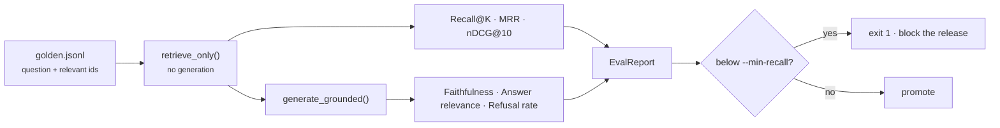

# Evaluation

Evaluation and tracing are part of the product, not weekend tasks. Without them
you cannot answer the only question that matters after a change: is it better or
worse?



## Golden dataset

JSONL, one example per line:

```json
{"id": "g1", "question": "What is hybrid retrieval?", "relevant_doc_ids": ["hybrid_retrieval"]}
{"id": "g2", "question": "Why separate offline and online?", "relevant_chunk_ids": ["a1b2c3..."]}
```

| Field | Meaning |
|---|---|
| `id` | stable identifier; keep it forever so results compare across runs |
| `question` | the query as a user would phrase it |
| `relevant_doc_ids` | documents that should be retrieved |
| `relevant_chunk_ids` | specific chunks, when you need passage-level precision |
| `expected_answer` | optional reference text |
| `should_refuse` | optional: assert the system declines to answer |

Prefer `relevant_doc_ids` for a dataset you intend to keep: chunk ids change
whenever chunking parameters change, so a chunk-id dataset silently rots after a
chunker upgrade.

### Agent golden examples

Agent eval adds `expected_tools` so tool-selection precision is measurable:

```json
{"id": "a1", "question": "Compare hybrid and dense retrieval.", "relevant_doc_ids": ["hybrid_retrieval"], "expected_tools": ["retrieval_search"]}
```

Deterministic agent CI uses `EchoChatLLM` and gates on **average steps and cost**,
not only task success — a change that doubles steps is a regression even when
answers still pass. See [agentic.md](agentic.md).

Two locations, on purpose:

- `tests/fixtures/golden.jsonl` — tiny, committed, runs in CI, no external services
- `data/golden/golden.jsonl` — your real curated set, gitignored like all data

### Building one that is worth having

Include cases that should **fail** to retrieve. A golden set of only answerable
questions cannot detect a system that has stopped refusing, and confident wrong
answers are the failure mode that costs you users. Aim for ~50 examples covering:

- questions answered by a single passage
- questions needing two or more passages
- questions with no answer in the corpus (`should_refuse`)
- questions using vocabulary that differs from the source text
- questions containing exact identifiers (error codes, SKUs) — these exercise the
  lexical leg specifically

## Metrics

### Retrieval

| Metric | Question it answers | Read it as |
|---|---|---|
| `Recall@5`, `Recall@10` | Is the answer present at all? | the ceiling on everything downstream |
| `MRR` | How high is the first relevant hit? | 1.0 = always rank 1 |
| `nDCG@10` | Is the whole ranking good, not just the top? | rewards relevant items ranked higher |

Recall is the metric to fix first. If the right passage is not retrieved, no
prompt, model, or reranker can recover it.

### Generation

| Metric | Question it answers |
|---|---|
| `Faithfulness` | Is the answer supported by the retrieved context, or invented? |
| `AnswerRelevance` | Does it address the question that was asked? |
| `RefusalRate` | How often does the system decline? |

Faithfulness and answer relevance here are **lexical-overlap heuristics** — they
are cheap, deterministic, and require no model. They catch gross unfaithfulness
and are directionally useful for regression detection. They are not
human-judgment substitutes, and an LLM-as-judge implementation belongs behind the
same `eval/metrics.py` interface when you need real numbers.

`RefusalRate` is a two-sided signal. Rising means retrieval degraded or the
threshold is too strict. Falling to zero on a set containing unanswerable
questions means the system stopped refusing, which is worse.

## Running it

```bash
# Self-contained: index the demo corpus in-process, then evaluate.
just eval

# Against your real corpus and golden set.
rag eval --dataset data/golden/golden.jsonl

# As a gate: non-zero exit if Recall@5 regresses.
rag eval --dataset data/golden/golden.jsonl --min-recall 0.8
```

Output:

```
EvalReport n=3
  Recall@5=1.000  Recall@10=1.000
  MRR=1.000  nDCG@10=1.000
  Faithfulness=0.818  AnswerRel=0.443
  RefusalRate=0.000
```

## Gating releases

The `quality-gate` job in `.github/workflows/ci.yml` fails the build on a
retrieval regression, the same way a broken unit test does:

```yaml
- run: uv run rag eval --dataset tests/fixtures/golden.jsonl
         --index-source tests/fixtures/corpus --min-recall 0.8
```

Before promoting a new index version in production, evaluate it *before* sending
traffic to it:

```bash
rag reindex --source data/raw --index-version v3 --no-activate
rag eval --dataset data/golden/golden.jsonl --min-recall 0.8   # against the built version
rag activate --index-version v3
```

That ordering is why `--no-activate` exists.

## What changes require an evaluation run

Anything that touches the path from corpus to answer:

- chunking strategy, size, or overlap
- embedding model (also requires a full reindex)
- `top_k`, `rerank_top_k`, RRF `k`, leg weights
- enabling multi-query, HyDE, or reranking
- prompt edits — a new prompt version is a new system
- `refusal_score_threshold`

Change one thing at a time. Two simultaneous changes with a net-zero metric
delta usually mean one helped and one hurt.

## Scheduled evaluation

`jobs/scheduled_eval.py` runs the same evaluation as a job against the live
index and logs a one-line summary. Run it nightly: retrieval quality drifts as
the corpus grows even when no code changes at all.

```bash
docker compose run --rm worker python main.py eval --dataset /data/golden/golden.jsonl
```
