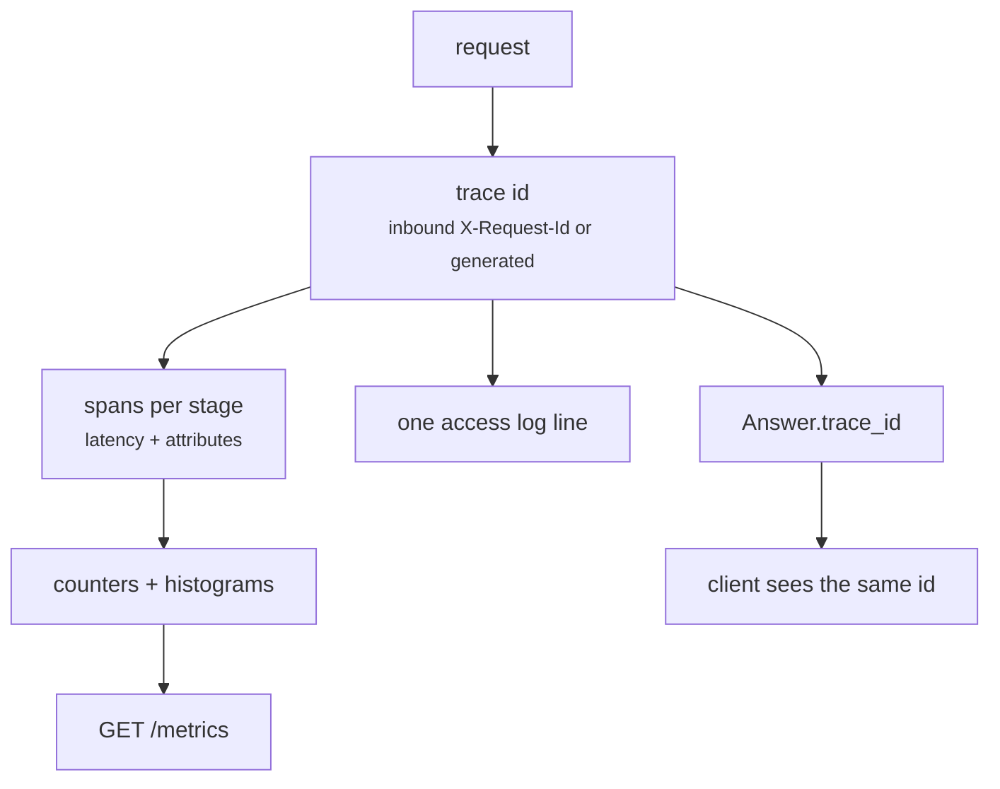

# Observability

The question in production is never "is it up?" — it is "why did *this* answer
look like that?". Answering it requires per-request traces, not aggregate
dashboards.



One id ties together the client's response, the access log, the spans, and the
metrics for a single request.

## Trace ids

`TraceMiddleware` accepts an inbound `X-Request-Id` and echoes it back, so traces
stitch together across services; it generates one when absent. The pipeline
*joins* that trace rather than starting its own (`start_trace()`), which is why
`Answer.trace_id` equals the header the caller sent.

A user reporting a bad answer only needs to give you that id.

## Spans

`observability/tracing.py` provides a `span()` context manager backed by a
`ContextVar`, with no OpenTelemetry dependency:

```python
with span("hybrid_retrieve", top_k=10, variants=1, acl=fingerprint) as attrs:
    ...
    attrs["fused"] = len(results)
```

Recorded spans per request:

| Span | Attributes worth reading |
|---|---|
| `online_pipeline` | `route`, `refused`, `citations` |
| `retrieve` / `hybrid_retrieve` | `top_k`, `variants`, `dense`, `lexical`, `fused`, `acl`, `acl_post_filtered` |
| `rerank` / `rerank_cross_encoder` | `candidates`, `returned` |
| `generate` | `prompt`, `refused`, `reason`, `citations`, `cost_usd` |
| `offline_pipeline` | `documents`, `parsed`, `chunks`, `index_version` |
| `ingest`, `parse`, `chunk`, `embed_index` | per-stage latency |

Two attributes are worth alerting on:

- **`acl_post_filtered` > 0** — a backend ACL filter let unauthorized chunks
  through and the post-fusion recheck caught them. Treat as a security defect.
- **`acl`** — the ACL *fingerprint*, not the identity. Enough to explain why a
  user saw nothing, without writing subjects or group names into logs.

`span()` records latency even when the body raises, and stores the error on the
record before re-raising, so a failed stage is still measured.

### Exporting to OpenTelemetry

`span()` is the seam. Wrap it, or emit each `SpanRecord` from `get_spans()` at the
end of a request. Deliberately no vendor dependency in the default build.

## Metrics

`MetricsRegistry` holds labelled counters and histograms in-process, exposed at
`GET /metrics` as JSON.

| Metric | Type | Use |
|---|---|---|
| `http_requests{path,status}` | counter | traffic and error rate |
| `http_latency_ms{path}` | histogram | end-to-end latency |
| `online_latency_ms` | histogram | pipeline latency, cache hits included |
| `cache_hit{kind=exact\|semantic}`, `cache_miss` | counter | hit rate |
| `semantic_cache_hit`, `semantic_cache_miss` | counter | semantic layer in isolation |
| `answers{refused}` | counter | refusal rate in production |
| `refusals{reason}` | counter | *why* it refuses — the actionable one |
| `llm_cost_usd`, `llm_total_tokens` | histogram | spend per answer |
| `answer_citations` | histogram | grounding density |
| `llm_attempt_ok{model}`, `llm_attempt_failed{model}` | counter | provider health per model |
| `generation_unavailable` | counter | every model and retry exhausted |
| `indexed_documents`, `indexed_chunks`, `parse_failures` | counter | offline job health |
| `api_errors{code}` | counter | 4xx/5xx breakdown |

This registry is **per-process and non-persistent** — it resets on restart and
each replica reports only its own numbers. That is deliberate: it makes the
metrics readable with zero infrastructure. Aggregating across replicas needs a
real exporter; `MetricsRegistry.snapshot()` is the seam.

Disable the endpoint with `RAG_METRICS_ENABLED=false` if it must not be reachable.

## Logging

`configure_logging(level, log_dir)` sets up stderr logging and, when `RAG_LOG_DIR`
is set, also writes `logs/app.log`. Container deployments should log to stdout and
let the platform collect it.

One access line per request, including the trace id:

```
2026-09-12 20:09:54 INFO [rag.api.access] POST /query -> 200 in 3.2ms trace=07cf5b33
```

Uvicorn's own access log is disabled to avoid duplicating it.

Query text is not logged at INFO. Queries are user content and often contain
exactly the sensitive material the rest of the system is careful about.

## Cost

`observability/cost.py` estimates spend per call from a per-model token price
table, and the figure travels on `Answer.usage.cost_usd`, so cost is attributable
per answer, per prompt version, and per model. Update the table when provider
prices change; a stale table produces confidently wrong numbers.

Cache hits cost nothing, which makes hit rate a direct cost lever.

## Health and readiness

Two endpoints, because they answer different questions:

| Endpoint | Question | Failure means |
|---|---|---|
| `/health` | Is the process alive? | restart the container |
| `/ready` | Can it answer a query? | stop routing traffic here |

`/ready` returns 503 unless the collection alias resolves **and** the index
contains chunks. An empty index would otherwise pass a naive check and serve
refusals that look like a corpus gap rather than an unfinished deploy.

```json
{
  "status": "ready",
  "checks": {"index_alias": true, "index_populated": true},
  "index_version": "v1",
  "chunk_count": 3,
  "authenticator": "static_token"
}
```

Wire `/health` to the liveness probe and `/ready` to the readiness probe. Using
`/health` for both is the classic mistake: traffic arrives before the index does.

## Debugging a bad answer

1. Get the `trace_id` from the response or the client's report.
2. Find the access line: status, latency, path.
3. Check `refused` and `refusal_reason` on the answer. A refusal is a *retrieval*
   problem far more often than a generation problem.
4. Look at the retrieval span: `dense` and `lexical` counts. Both zero means an
   ACL or index-version issue, not a relevance issue. Compare `acl` against the
   caller's expected scope.
5. Non-zero `acl_post_filtered`: a backend filter is broken. Stop and treat it as
   a security issue.
6. `fused` healthy but the answer is wrong: it is a ranking problem. Enable
   reranking, or add the case to the golden set and tune with
   [retrieval.md#tuning](retrieval.md#tuning).
7. High latency with `cache_miss`: check which stage dominates the spans against
   the budget in [online-pipeline.md](online-pipeline.md#latency-budget).

## Suggested alerts

| Condition | Why it matters |
|---|---|
| `acl_post_filtered` > 0 | potential data-leak defect |
| `refusals{reason=no_retrieved_context}` rising | index or ACL regression |
| `refusals{reason=llm_unavailable}` > 0 | provider outage |
| p95 `http_latency_ms` above budget | user-visible slowness |
| `cache_hit` rate collapse | usually an unintended scope change |
| `parse_failures` rising | upstream data format changed |
| `/ready` failing after a deploy | index not published |
