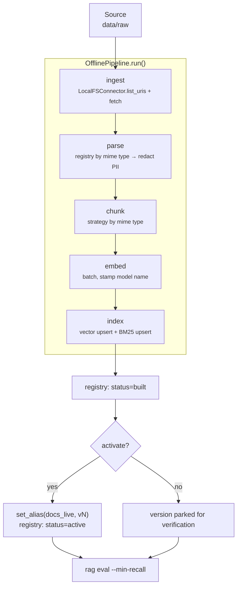
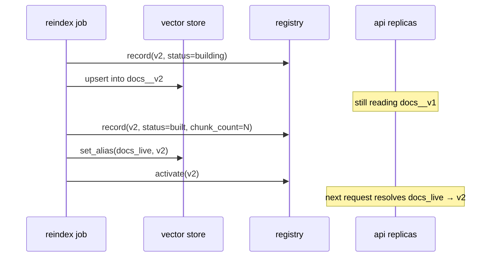

# Offline pipeline

`Ingest → Parse → Chunk → Embed → Index → Publish → Evaluate`

Implemented in `src/rag/pipelines/offline.py`, invoked only from `src/rag/jobs/`.
Nothing under `src/rag/api/` may import it, and a test enforces that.



## Stage 1 — Ingest

`ingestion/local_fs.py` walks a directory, and for each file produces a
`Document` with a `file://` URI, a SHA-256 checksum, a guessed mime type, and
**ACL tags**.

Roots are resolved to absolute paths before building the URI:

```python
self.root = Path(root).expanduser().resolve()
```

Without this, `Path.as_uri()` raises on a relative path — the failure only
appears in real use, never in tests that happen to pass absolute paths, so there
is a regression test for it.

ACLs come from the caller, defaulting to tenant-wide when omitted:

```bash
rag ingest --source data/raw --tenant acme --groups engineering,hr
```

Everything ingested in one run shares one ACL. Mixed-permission corpora need one
run per permission set, or a connector that derives ACLs from the source system
(the correct long-term answer — see [security.md](security.md#acl-sources)).

To add a source, implement the `SourceConnector` protocol and register it:

```python
from rag.ingestion import register

register("s3", lambda **kw: S3Connector(**kw))
```

## Stage 2 — Parse

`parsing/registry.py` dispatches on `Document.mime_type`:

| Mime type | Parser | Notes |
|---|---|---|
| `text/plain` | `TextParser` | normalizes whitespace |
| `text/markdown` | `MarkdownParser` | keeps heading structure for the chunker |
| `text/html` | `HtmlParser` | strips tags, script, style |
| `application/pdf` | `PdfParser` | needs the `pdf` extra; scanned PDFs need OCR upstream |

Two things happen here that matter more than the parsing itself:

**PII redaction happens before anything is embedded.** Redacting at answer time
alone would still leave raw PII sitting in the vector store and the lexical
index. Controlled by `RAG_PII_REDACTION_ENABLED`.

**A malformed document is skipped, not fatal.** Parse failures increment
`parse_failures` and log a warning. A single corrupt file in a 100k-document
corpus must not fail a four-hour reindex.

## Stage 3 — Chunk

Strategy per document type, not one splitter for everything.
`configs/chunking.yaml` maps mime types to strategies and sizes:

| Strategy | Splits on | Use for |
|---|---|---|
| `fixed` | character windows | logs, uniform text |
| `recursive` | paragraph → sentence → word | general prose, the safe default |
| `markdown_aware` | headings, then recursive inside sections | docs, wikis, READMEs |
| `semantic` | embedding-similarity troughs between sentences | dense prose with no structure |

`SemanticChunker` falls back to recursive splitting when no embedder is supplied,
marking chunks with `semantic_fallback: true`. A misconfiguration degrades
quality instead of breaking ingestion. Enable the real behaviour explicitly:

```python
from rag.chunking import enable_semantic_chunking

enable_semantic_chunking(embedder)
```

`chunk_document` rejects `overlap >= size`, which would otherwise loop or emit
duplicate text.

## Stage 4 — Embed

Batched through the `Embedder` protocol. Each chunk gets the model name stamped
on it:

```python
stamped = [c.model_copy(update={"embedding_model": self.embedder.model_name}) for c in chunks]
```

Vectors from different models are not comparable. Stamping makes a mixed-model
index a detectable state rather than a mysterious quality drop. `HashEmbedder`
(default) is deterministic and dependency-free — good for tests, useless for
semantics, and refused in production by `Settings`.

## Stage 5 — Index

Both indexes are written in the same stage, from the same chunk list, so dense
and lexical retrieval can never drift out of sync:

```python
self.vector_store.upsert(stamped, vectors)
self.lexical_index.upsert(stamped)
```

Writes target `docs__vN` (`Settings.collection_for(version)`), never the alias.

## Stage 6 — Publish



Readers resolve the alias per request, so promotion needs no restart and no
redeploy. `--no-activate` builds without publishing, which is what you want when
you intend to evaluate before sending traffic.

## Stage 7 — Evaluate

Evaluation is a pipeline stage, not a follow-up task:

```bash
rag eval --dataset data/golden/golden.jsonl --min-recall 0.8
```

Non-zero exit on regression, so it can gate a promotion in CI. See
[evaluation.md](evaluation.md).

## Running it

```bash
rag ingest  --source data/raw                        # build and publish
rag reindex --source data/raw --index-version v2 --no-activate
rag activate --index-version v2                      # publish when satisfied
rag versions                                         # history and active version
```

The in-memory backends live only inside one process, so `rag ingest` in one shell
is invisible to an API started in another. That is a property of the stubs, not
the design; with Qdrant and OpenSearch the index is shared. For a self-contained
evaluation run, index in the same process:

```bash
rag eval --dataset tests/fixtures/golden.jsonl --index-source tests/fixtures/corpus
```

## Cost and duration

Embedding dominates both. For a corpus of `N` chunks the job costs roughly
`N × chunk_tokens` embedding tokens; the rest is I/O. Practical levers:

- raise chunk `size` to reduce chunk count (at some cost to retrieval precision)
- reindex only changed documents (compare `Document.checksum`) — the schema
  supports it, the current job rebuilds wholesale
- batch size is already capped at 128 inputs per embedding request
