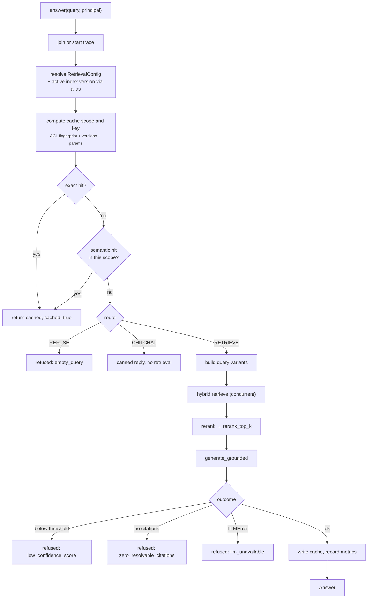
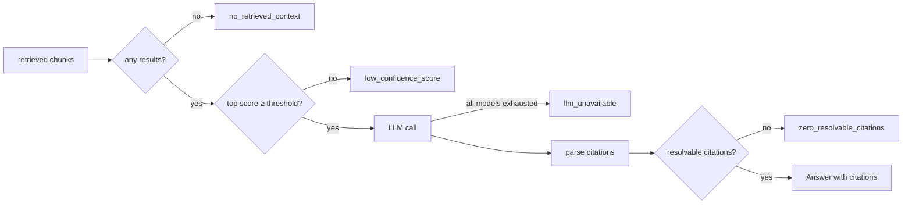

# Online pipeline

`Query Rewrite → Hybrid Retrieve → Rerank → Generate → Cite → Refuse`

Implemented in `src/rag/pipelines/online.py`. Read-only with respect to the
index: there is no code path from a request to a write.



## Stage 0 — Trace

`start_trace()` joins an ambient trace if one exists (the API middleware sets it
from `X-Request-Id`) and starts a fresh one otherwise. That is why the
`trace_id` on an answer matches the access log line and the caller's request id;
correlation across three places is the whole point.

## Stage 1 — Cache lookup

Two caches, checked in order, both scoped by ACL:

```python
scope = cache_scope(principal, index_version, prompt_version, retrieval_params)
key = sha256(f"{scope}|{normalize_query(query)}")
```

The scope binds the ACL fingerprint, index version, prompt version, and
retrieval parameters. A new index version, a prompt edit, or a `top_k` change
invalidates the cache implicitly — no manual flush, no stale answers from a
retired corpus. Details: [caching.md](caching.md).

## Stage 2 — Route

`query/route.py` classifies before spending anything:

| Route | Trigger | Behaviour |
|---|---|---|
| `REFUSE` | empty or whitespace-only | refuse immediately |
| `CHITCHAT` | greeting patterns | short reply, no retrieval, no generation |
| `RETRIEVE` | everything else | full pipeline |

## Stage 3 — Query variants

Three strategies, all off the same seam, configured in
`configs/retrieval.yaml`:

| Setting | Effect | Cost |
|---|---|---|
| `rewrite_enabled` (default on) | normalization and light expansion | negligible |
| `multi_query_enabled` | `multi_query_count` paraphrases, all retrieved and fused | N× retrieval |
| `hyde_enabled` | embed a hypothetical answer for the dense leg only | N× retrieval |

HyDE deliberately rewrites only the dense query. The lexical leg keeps the user's
literal words, because BM25 matching a synthetic passage tends to match its
invented phrasing rather than the corpus:

```python
scored = retriever.retrieve_multi(
    variants,  # lexical legs use the real query text
    dense_queries=dense_variants,  # dense legs may use hypothetical documents
)
```

Multi-query and HyDE default to off: both multiply retrieval latency and are
worth enabling only when evaluation shows they help your corpus.

## Stage 4 — Hybrid retrieve

Dense and lexical run concurrently, then all ranked lists fuse with RRF, then
ACLs are re-checked. Full detail in [retrieval.md](retrieval.md).

## Stage 5 — Rerank

`identity` (default) preserves fused order. `cross_encoder` scores every
`(query, chunk)` pair jointly — much more accurate, far too slow to run over a
corpus, which is exactly why it runs over `top_k` candidates *after* retrieval
and *before* generation.

## Stage 6 — Generate, cite, refuse

`generation/grounded.py`:

1. Refuse before spending a token if retrieval produced nothing usable.
2. Render a **versioned prompt** from `prompts/templates/` — prompts are files
   with a version, not string literals buried in application code.
3. Build context with explicit `[chunk_id=...]` markers so the model has stable
   handles to cite.
4. Call the LLM through `ResilientLLM` (per-attempt timeout, exponential backoff
   with jitter, ordered model fallback).
5. Redact PII from the output.
6. Resolve citations by matching emitted chunk ids back to retrieved chunks —
   a citation that does not resolve is not a citation.
7. Refuse if nothing resolved.



Refusal is the safe default at every branch. A wrong answer with a confident
tone is more expensive than no answer.

## Stage 7 — Cache write

Successful answers are cached under both the exact key and the semantic bucket.
**Refusals are never cached.** A refusal often reflects a transient condition —
an index mid-build, a model outage — and caching it would extend an incident for
a full TTL.

## Latency budget

Where the milliseconds go, with the default configuration:

| Stage | Typical share | Notes |
|---|---|---|
| Auth + routing | <1 ms | in-process |
| Cache lookup | 1–3 ms | Redis round trip |
| Embed query | 10–50 ms | one provider call; the first real network hop |
| Dense + lexical | 10–40 ms | concurrent, so ≈ the slower leg |
| RRF + ACL recheck | <1 ms | pure Python over ≤ `top_k` items |
| Rerank (cross-encoder) | 50–300 ms | biggest optional cost |
| Generation | 300–3000 ms | dominates everything else |

Two consequences: a cache hit skips essentially all of it, and optimizing
retrieval to save 10 ms while generation takes 2 s is the wrong place to look.

## Timeouts and failure behaviour

| Failure | Behaviour |
|---|---|
| Cache unreachable | logged, treated as a miss; request proceeds |
| Vector or lexical backend down | exception propagates → 500 with an opaque body and a trace id |
| One LLM attempt times out | retried with backoff, then the next model in the chain |
| All LLM models exhausted | `refused: llm_unavailable` (HTTP 200) |
| Unhandled exception | 500, internals logged, never returned to the caller |
