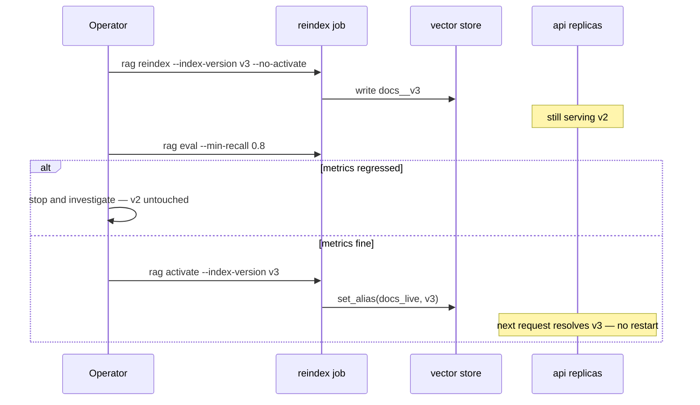
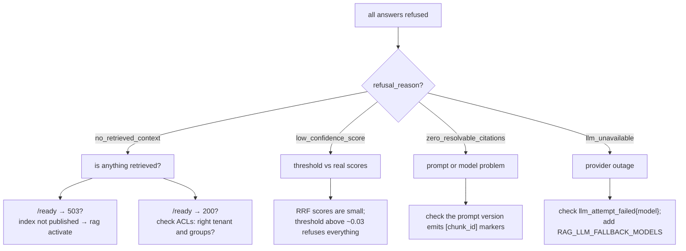

# Operations

Runbooks. Each one assumes the offline job and the API are separate processes and
that the collection alias is the only thing that decides what users see.

## Reindex and promote

The safe sequence: build, evaluate, then publish.



```bash
rag reindex --source data/raw --index-version v3 --no-activate
rag eval --dataset data/golden/golden.jsonl --min-recall 0.8
rag activate --index-version v3
rag versions
curl -s localhost:8000/ready | jq .index_version
```

Never write into the version that is currently live. `--no-activate` exists so
that "built" and "serving" are separate decisions.

Expect a cache miss storm right after promotion: the index version is part of
every cache key, so a new version means a cold cache. That is correct, and it is
why you promote during a quiet period if latency matters.

## Roll back

An alias flip, and nothing else. No redeploy, no restart:

```bash
rag versions                          # find the last good version
rag activate --index-version v2
curl -s localhost:8000/ready | jq .index_version
```

This works because old versions are not deleted on promotion. Keep at least one
previous version until the new one has proven itself.

## Change the embedding model

A different embedder produces vectors that are not comparable with the existing
index. Treat it as a full rebuild, never an in-place update:

```bash
RAG_EMBEDDING_MODEL=text-embedding-3-large \
RAG_EMBEDDING_DIMENSIONS=3072 \
rag reindex --source data/raw --index-version v4 --no-activate
rag eval --dataset data/golden/golden.jsonl
rag activate --index-version v4
```

`Chunk.embedding_model` is stamped at index time, so `rag versions` shows which
model built each version — that is how you detect a half-migrated index.

## Change a prompt

Prompts are versioned files in `src/rag/prompts/templates/`. Add a new version
rather than editing one in place; the version is recorded in `Answer.usage` and
folded into cache keys, so an edited prompt cannot serve answers generated by the
old instructions.

1. Add `answer_grounded.v2.md`.
2. Set `prompt_version="v2"` on the pipeline.
3. Evaluate: a prompt change is a system change.
4. Roll back by pointing at `v1` again.

## Add documents

The current job rebuilds a version wholesale, which is simple and predictable:

```bash
rag reindex --source data/raw --index-version v5
```

For a large corpus where full rebuilds are too slow, `Document.checksum` is the
hook for incremental indexing — compare against what is indexed and upsert only
changes. The schema supports it; the job does not implement it yet.

## Ingest content with different permissions

One `rag ingest` run stamps one ACL. Mixed corpora need one run per permission
set, into the same index version:

```bash
rag reindex --source data/public --index-version v6 --groups public --no-activate
rag reindex --source data/hr     --index-version v6 --tenant acme --groups hr --no-activate
rag activate --index-version v6
```

Better long-term: derive ACLs inside the connector from the source system, so they
cannot drift. See [security.md](security.md#acl-sources).

## Scheduled evaluation

Run nightly against the live index. Retrieval quality drifts as a corpus grows
even when no code changes.

```bash
docker compose run --rm worker \
  python main.py eval --dataset /data/golden/golden.jsonl --min-recall 0.8
```

Alert on the non-zero exit, not on the log output.

---

# Incidents

## Everything refuses



Fastest triage: `curl -s localhost:8000/ready`. A 503 means no index is live and
the answer is `rag activate`, not a code change.

## Latency spike

1. `GET /metrics` — check `cache_hit` vs `cache_miss`. A hit-rate collapse usually
   follows a deploy that changed the index version or a prompt.
2. Check spans for the dominant stage against the budget in
   [online-pipeline.md](online-pipeline.md#latency-budget).
3. If generation dominates, the provider is slow: lower
   `RAG_LLM_MAX_OUTPUT_TOKENS`, or fail over with `RAG_LLM_FALLBACK_MODELS`.
4. If retrieval dominates, disable `multi_query`/`hyde` first (they multiply
   retrieval), then reranking.
5. Emergency lever: `RAG_RERANKER=identity` and `RAG_MULTI_QUERY_ENABLED=false`,
   then restart. Quality drops, latency recovers.

## Suspected data leak

Follow [security.md](security.md#incident-response). First moves: disable the
cache, revoke the token, then check `acl_post_filtered` on retrieval spans to
identify which layer failed.

## Provider outage

The LLM layer already retries with backoff and falls back across models, then
refuses with `llm_unavailable` rather than inventing an answer. Nothing to do
in-process except confirm fallbacks are configured:

```bash
RAG_LLM_FALLBACK_MODELS=gpt-4o,gpt-4o-mini
```

Embedding outages are worse, because a query cannot be embedded at all: the dense
leg fails and the request errors. A future improvement is degrading to
lexical-only retrieval when embedding fails.

## Vector store down

Requests return 500 with a trace id. There is deliberately no silent fallback to
lexical-only: quietly serving worse answers hides an outage. Restore the store,
then confirm with `/ready`.

## Corrupt or partial index

Symptom: `rag versions` shows `status=building` for a version that no job is
writing — a crashed job.

```bash
rag versions                              # confirm the live version is still good
rag reindex --source data/raw --index-version v7 --no-activate
rag eval --dataset data/golden/golden.jsonl
rag activate --index-version v7
```

Never promote a version stuck in `building`.

---

## Routine checks

| Cadence | Check |
|---|---|
| Continuous | `/ready` on every replica; alerts from [observability.md](observability.md#suggested-alerts) |
| Daily | refusal rate by reason; cache hit rate; cost per answer |
| Nightly | scheduled evaluation against the live index |
| Weekly | `rag versions` — prune versions you no longer need for rollback |
| Per release | evaluation gate, then promote |
| Quarterly | review golden set coverage against real user questions |
