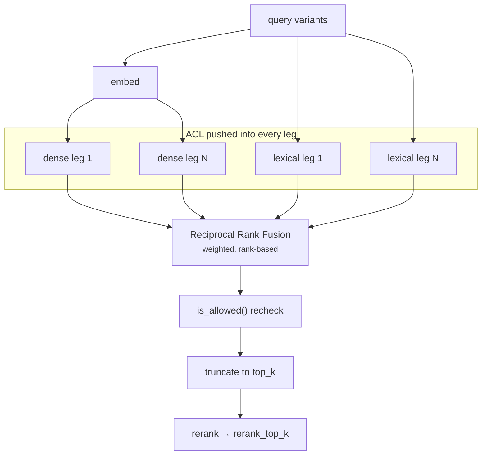
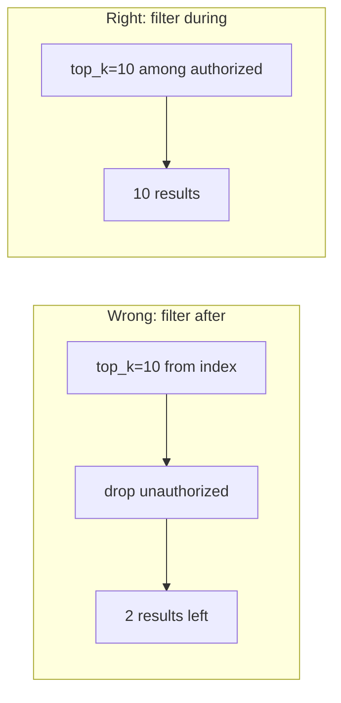

# Retrieval

Dense retrieval alone is not enough. Embeddings capture meaning and miss exact
tokens; BM25 captures exact tokens and misses meaning. A question containing an
error code, a product SKU, or a person's name needs the lexical leg. A question
phrased entirely differently from the source text needs the dense leg.



## Reciprocal Rank Fusion

```
score(chunk) = Σ_legs  weight_leg / (k + rank_leg(chunk))
```

Rank-based, not score-based, and that is the point: a cosine similarity of `0.83`
and a BM25 score of `14.2` are not comparable quantities. Normalizing them
requires knowing each backend's score distribution, which changes with the corpus.
Ranks are always comparable.

`k` (default 60, `RAG_RRF_K`) damps the influence of the very top ranks. With
`k=60`, rank 1 contributes `1/61` and rank 2 contributes `1/62` — close together,
so a chunk that both legs rank highly beats a chunk that one leg ranks first and
the other misses entirely. Lowering `k` makes the system trust individual top
hits more; raising it rewards consensus.

A worked example from `tests/test_rrf.py`: a chunk ranked 1 by dense and 2 by
lexical with equal weights scores `1/61 + 1/62 ≈ 0.0323`.

**Fused scores are small.** Two legs at rank 1 give at most `2/61 ≈ 0.0328`. This
is why `refusal_score_threshold` defaults to `0.01` rather than something that
looks like a probability — it is compared against RRF output, not a similarity.
Changing `rrf_k`, the number of legs, or the leg weights changes the scale, and
the threshold must be re-derived from an evaluation run, not guessed.

### Weights

`dense_weight` and `lexical_weight` (both `1.0`) scale each leg's contribution.
Raise `lexical_weight` for corpora full of identifiers and code; raise
`dense_weight` for conversational corpora where wording varies. Change one at a
time and measure with `rag eval`.

## BM25

`lexical/bm25_memory.py` implements BM25 in-process for the dependency-free
profile:

```
idf(t)   = log(1 + (N - df(t) + 0.5) / (df(t) + 0.5))
score(d) = Σ_t idf(t) · (f(t,d) · (k1 + 1)) / (f(t,d) + k1 · (1 - b + b · |d|/avgdl))
```

with `k1 = 1.5` (term-frequency saturation) and `b = 0.75` (length
normalization). `OpenSearchLexicalIndex` delegates to OpenSearch's own BM25,
which is the same formula with a production inverted index behind it.

## ACL pushdown

Filters are evaluated **inside** each backend, not applied to results:



Filtering afterwards silently shrinks the candidate set — a user in a restrictive
group would get near-empty results even when plenty of authorized content exists.
It is also fragile: forget the post-filter in one code path and it becomes a leak.

Each adapter translates `AclFilter` into its native language:

- **Qdrant** — a `models.Filter` with `must` on `tenant` (and `index_version`)
  plus `should` requiring either an empty `allow_groups` or a `MatchAny` overlap.
  `tenant`, `allow_groups`, and `index_version` get payload indexes at collection
  creation so the filter stays cheap.
- **OpenSearch** — a `bool.filter` with `term` on `tenant` and a nested
  `should`/`minimum_should_match: 1` for the group overlap. Tenant-wide chunks
  omit the `allow_groups` field entirely so `must_not exists` matches them.
- **memory** — the `is_allowed()` predicate during the scan.

After fusion, `is_allowed()` runs again over the fused list. Redundant by
design: a filter regression in one adapter should cost recall, not become a data
leak. The count of chunks dropped by that recheck is recorded as
`acl_post_filtered` on the span — a non-zero value means a backend filter is
wrong and should be investigated immediately.

## Concurrency

All legs are submitted to a thread pool at once:

```python
with ThreadPoolExecutor(max_workers=self.max_workers) as pool:
    dense_futures = [pool.submit(dense, v) for v in vectors]
    lexical_futures = [pool.submit(lexical, q) for q in queries]
```

Both legs are I/O-bound HTTP calls, so threads are the right tool and the GIL is
not a factor. Hybrid retrieval therefore costs roughly the slower leg rather than
the sum. With multi-query enabled, `max_workers` (default 4) bounds the fan-out
so a 5-variant query does not open 10 simultaneous connections per request.

## Tuning

Change one parameter, run `rag eval`, keep it only if the metrics improve.

| Symptom | Try |
|---|---|
| Right document, wrong passage | smaller chunk `size`; enable `cross_encoder` |
| Exact terms and codes not found | raise `lexical_weight`; check the analyzer |
| Paraphrased questions fail | raise `dense_weight`; try a better embedding model |
| Recall fine, top-1 wrong | enable reranking; that is exactly its job |
| Everything refuses | check `refusal_score_threshold` against real fused scores |
| Low recall on multi-part questions | enable `multi_query_enabled` |
| Sparse corpus, vague questions | try `hyde_enabled` |
| Latency too high | disable multi-query/HyDE first, then reranking |

Read `top_k` and `rerank_top_k` as a funnel: retrieve broadly enough that the
answer is present at all (`top_k`), then narrow to what fits in a prompt without
diluting it (`rerank_top_k`). A large `rerank_top_k` costs tokens and tends to
lower faithfulness, because more irrelevant context gives the model more to
wander into.
