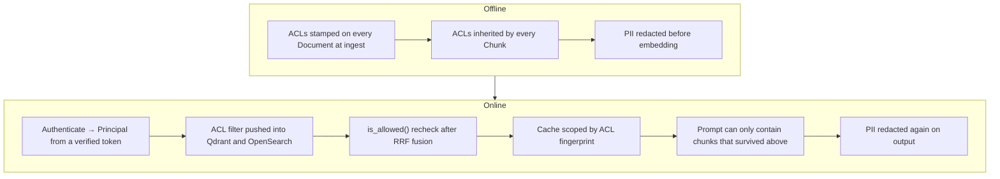

# Security

> Never embed or retrieve a document a user isn't allowed to access.

In a RAG system the retriever is a confused deputy: it reads everything and
speaks to everyone. A leak does not look like a leak — it looks like a helpful
answer that happens to quote another tenant's contract.

## Defense in depth



Six layers, and each assumes the others might fail.

## Authentication

`Principal` must come from something the caller cannot forge. The default posture
is **fail closed**: with no authenticator configured, every request gets 401.

| Authenticator | Identity source | Use |
|---|---|---|
| `StaticTokenAuthenticator` | bearer token → principal, from a YAML file | default production seam |
| `TrustedHeaderAuthenticator` | `X-Tenant`, `X-Groups`, `X-Subject` headers | **local dev only** |
| `AnonymousAuthenticator` | fixed anonymous principal | explicitly public demos |
| `DenyAllAuthenticator` | nothing | selected automatically when auth is required but unconfigured |

### Why header trust is dangerous

With `TrustedHeaderAuthenticator`, this is a complete privilege escalation:

```bash
curl -X POST localhost:8000/query \
  -H 'X-Tenant: competitor-corp' -H 'X-Groups: admin,finance' \
  -d '{"query":"summarize the acquisition terms"}'
```

The caller chose their own ACL. Every layer below behaves correctly and still
returns another tenant's data, because the input to the whole chain was a lie.

Two guards make this impossible to ship by accident:

1. `Settings` raises at startup if `auth_trust_headers` is true when
   `RAG_ENV` is `staging` or `production`. The process refuses to start.
2. `StaticTokenAuthenticator` ignores ACL headers entirely — a token's principal
   is the only principal. `test_static_token_ignores_acl_headers` asserts that a
   request carrying `X-Tenant: acme` on a `beta` token stays `beta`.

The same validator rejects `auth_required=false` and the stub `hash` embedder and
`echo` LLM in production. Failing at startup beats discovering it from traffic.

### Static tokens

```yaml
# configs/auth.yaml — gitignored; see configs/auth.example.yaml
tokens:
  - token: "<openssl rand -hex 32>"
    subject: "svc-acme-search"
    tenant: "acme"
    groups: ["engineering", "public"]
```

```bash
RAG_AUTH_TOKENS_FILE=configs/auth.yaml
```

Tokens are compared with `hmac.compare_digest` and never logged. This is a real
mechanism, not a placeholder, but it has the limits of any shared secret: no
expiry, no revocation beyond editing the file, no per-user identity.

### Wiring a real identity provider

Implement the `Authenticator` protocol — that is the whole integration:

```python
class OidcAuthenticator:
    name = "oidc"

    def authenticate(self, credentials: Credentials) -> Principal:
        token = _bearer_token(credentials.authorization)
        if not token:
            raise AuthError("missing_bearer_token")
        claims = verify_jwt(token, jwks=self._jwks, audience=self._audience)
        return Principal(
            subject=claims["sub"],
            tenant=claims["tenant"],  # from the token, never the request
            groups=frozenset(claims.get("groups", [])),
        )
```

Then pass it in: `build_state(authenticator=OidcAuthenticator(...))`. Replace the
class; never loosen the existing one.

## Chunk-level ACLs

```python
def is_allowed(principal: Principal, acl: AclTags) -> bool:
    if principal.tenant != acl.tenant:
        return False
    if not acl.allow_groups:
        return True
    return bool(principal.groups & acl.allow_groups)
```

Access control lives on the **chunk**, not the document or the collection.
Retrieval returns chunks, so that is where the check has to be — a
document-level check cannot express "this paragraph is restricted", and a
collection-level check forces one index per permission set.

Tenant is a hard wall: no group membership can cross it. Empty `allow_groups`
means tenant-wide, not public; there is deliberately no cross-tenant "public".

### ACL sources

The CLI stamps one ACL per run:

```bash
rag ingest --source data/hr --tenant acme --groups hr
```

This is correct but coarse. For a real corpus, derive ACLs inside the connector
from the source system's own permissions (SharePoint groups, Drive sharing, S3
tags) so they cannot drift from the source of truth. Mixed-permission corpora
otherwise need one ingest run per permission set.

## PII redaction

`security/pii.py` redacts email addresses, phone numbers, and SSN-shaped strings,
at two points:

1. **Before embedding**, in the offline parse stage. Redacting only at output
   would leave raw PII in the vector store, in the lexical index, and in every
   backup of both.
2. **After generation**, in case a model reproduces something from a chunk
   indexed before redaction was enabled.

The patterns are regex-based and therefore a floor, not a ceiling. Names,
addresses, and account numbers need a real NER-based classifier; treat this as
the seam where one goes.

## Cache isolation

The ACL fingerprint is part of every cache key and every semantic bucket. See
[caching.md](caching.md#the-scope-is-the-security-boundary). A cache is the
easiest place in a RAG system to leak data, because the natural key — the query
text — is identical across tenants.

## Secrets

| Where | Rule |
|---|---|
| `.env` | gitignored; `.env.example` documents the shape with no values |
| `configs/auth.yaml` | gitignored; only `auth.example.yaml` is tracked |
| `configs/*.yaml` | non-secret configuration only |
| Container images | no secrets baked in; injected as environment at runtime |
| Logs | no tokens, no query text at INFO, ACL *fingerprints* rather than identities |

Use your platform's secret manager in production and inject at runtime. The
`.env` file is a local-development convenience.

## Transport and API surface

- TLS terminates at the load balancer; the container serves plain HTTP inside the
  network boundary.
- CORS is **off** unless `RAG_CORS_ALLOW_ORIGINS` lists explicit origins. No
  wildcard default.
- Query length is capped at 4000 characters (`QueryRequest`), bounding prompt
  cost per request.
- 500 responses carry an opaque body plus a trace id; details go to logs only.
- `/metrics` is unauthenticated and can be disabled with
  `RAG_METRICS_ENABLED=false`. Keep it on an internal listener.
- The container runs as uid 10001, read-only root filesystem, `no-new-privileges`.

## Known limitations

Honest list, so nobody assumes coverage that is not there:

| Gap | Consequence | Mitigation |
|---|---|---|
| No rate limiting | a single caller can exhaust model budget | enforce at the gateway |
| No prompt-injection defense | a poisoned document can try to redirect the model | prompts instruct grounding; citations are verified; treat ingestion as trusted input |
| Static tokens do not expire | leaked token is valid until removed | wire an IdP for production |
| Regex PII only | structured PII slips through | add a classifier in `security/pii.py` |
| No audit log of answers | limited forensics after an incident | traces carry ids; add a durable sink |

## Incident response

If a caller may have seen unauthorized content:

1. **Contain.** Set `RAG_CACHE_ENABLED=false` and restart, so no poisoned entry
   can be served again. Revoke the token in `configs/auth.yaml`.
2. **Scope it.** Find the affected requests by trace id in the access log. Spans
   record the ACL fingerprint, so you can identify which scope was used without
   the log containing identities.
3. **Find the layer that failed.** Check `acl_post_filtered` on retrieval spans:
   non-zero means a backend filter let unauthorized chunks through and layer 4
   caught them. Zero, with a confirmed leak, points at ingest — chunks stamped
   with the wrong ACL.
4. **Fix forward.** If the ACLs were wrong at ingest, correct the source and
   `rag reindex` a new version; do not patch the live index in place.
5. **Add a test.** Every ACL bug becomes a regression test in
   `tests/test_acl.py` before the fix is considered complete.
